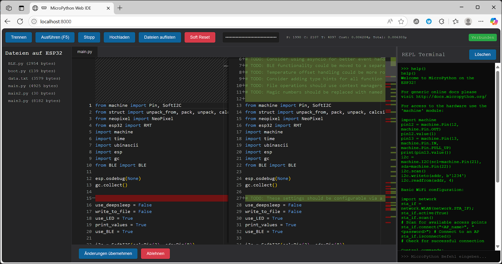

# MicroPython Web IDE

Eine einfache webbasierte IDE zur Interaktion mit MicroPython-Geräten (wie ESP32) über die Web Serial API.

## Funktionen

*   **Verbinden/Trennen**: Stellt eine serielle Verbindung zum MicroPython-Gerät her.
*   **Code-Editor**: Monaco-Editor für die Bearbeitung von Python-Dateien.
*   **REPL-Terminal**: Direkte Interaktion mit der MicroPython REPL.
*   **Datei-Management**:
    *   Dateien auf dem Gerät auflisten.
    *   Dateien vom Editor auf das Gerät hochladen.
    *   Dateien vom Gerät in den Editor laden.
    *   Kontextmenü für Dateien (Rechtsklick) zum Löschen und Umbenennen.
*   **Code-Ausführung**: Ausführen der aktuell im Editor geladenen Datei auf dem Gerät.
*   **Steuerung**:
    *   Laufende Skripte stoppen (Ctrl+C).
    *   Soft Reset (Ctrl+D).
*   **Benutzeroberfläche**:
    *   Tabs für geöffnete Dateien (derzeit nur eine Datei gleichzeitig aktiv im Editor).
    *   Fortschrittsanzeige beim Hochladen von Dateien.
    *   Terminalausgabe löschen.
    *   Verschiebbarer Trenner zwischen Code-Editor und REPL-Terminal.
*   **LLM-Integration (DeepSeek)**:
    *   Eingabefeld für DeepSeek API-Schlüssel (wird im Local Storage des Browsers gespeichert und maskiert angezeigt).
    *   Prompt-Eingabe zur Code-Generierung oder -Anpassung.
    *   System-Prompt zur Generierung von MicroPython-Code für Mikrocontroller.
    *   **Diff-Ansicht**: Zeigt Änderungen des LLMs im Vergleich zum aktuellen Code an.
    *   Möglichkeit, LLM-Änderungen zu übernehmen oder abzulehnen.
    *   Anzeige der Token-Nutzung (Prompt, Completion, Total) und geschätzter Kosten für jede LLM-Anfrage sowie eine Gesamtsumme für die Sitzung.

## Verwendung

1.  Öffnen Sie die `index.html` Datei in einem Webbrowser, der die Web Serial API unterstützt (z.B. Google Chrome, Microsoft Edge).
2.  Klicken Sie auf "Mit ESP32 verbinden" und wählen Sie den seriellen Port Ihres Geräts.
3.  Nutzen Sie die Buttons in der Toolbar, um mit dem Gerät zu interagieren, Dateien zu bearbeiten und Code auszuführen.
4.  **Für die LLM-Funktion**:
    *   Geben Sie Ihren DeepSeek API-Schlüssel in das dafür vorgesehene Feld in der Toolbar ein. Die Token-Nutzung und geschätzte Kosten werden daneben angezeigt.
    *   Geben Sie einen Prompt in das Feld unter dem Editor ein und klicken Sie auf "An DeepSeek senden".
    *   Überprüfen Sie die vom LLM vorgeschlagenen Änderungen in der Diff-Ansicht.
    *   Klicken Sie auf "Änderungen übernehmen" oder "Ablehnen".

## Voraussetzungen

*   Ein MicroPython-fähiges Gerät (z.B. ESP32).
*   Ein Webbrowser, der die Web Serial API unterstützt.
*   USB-Treiber für das Gerät, falls erforderlich.

## Hinweis

Dieses Projekt ist eine einfache Demonstration und dient als Grundlage. Es können Fehler auftreten und es fehlen fortgeschrittene Funktionen einer vollwertigen IDE.
