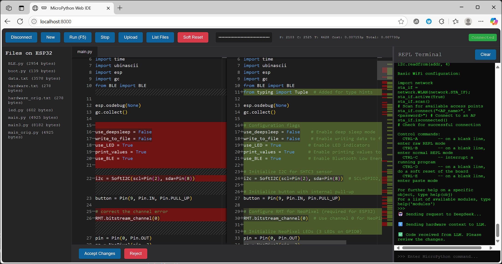

# MicroPython Web IDE

A simple web-based IDE for interacting with MicroPython devices (like ESP32) via the Web Serial API.

## Features

*   **Connect/Disconnect**: Establishes a serial connection to the MicroPython device.
*   **Code Editor**: Monaco editor for editing Python files.
*   **REPL Terminal**: Direct interaction with the MicroPython REPL.
*   **File Management**:
    *   List files on the device.
    *   Upload files from the editor to the device (supports `.py` and `.txt`).
    *   Load files from the device into the editor.
    *   Context menu for files (right-click) to delete and rename.
    *   "New" button to clear the editor and start a new file.
*   **Code Execution**: Execute the currently loaded file in the editor on the device.
*   **Control**:
    *   Stop running scripts (Ctrl+C).
    *   Soft Reset (Ctrl+D).
*   **User Interface**:
    *   Tabs for open files (currently only one file active in the editor at a time).
    *   Progress bar for file uploads.
    *   Clear terminal output.
    *   Resizable splitter between the code editor and REPL terminal.
*   **LLM Integration (Multi-provider)**:
    *   Model selection (DeepSeek, OpenAI, Ollama) and API key configuration via modal dialog
    *   For Ollama: customizable URL and model name inputs
    *   Send button label updates to show selected model (e.g., "Send to deepseek-chat")
    *   System prompt to generate MicroPython code for microcontrollers
    *   Automatic loading of `hardware.txt` for hardware context
    *   **Diff View**: Displays LLM changes compared to current code
    *   Ability to accept or reject LLM changes
    *   Display of token usage (Prompt, Completion, Total) and estimated cost

## Usage

1.  Open the `index.html` file in a web browser that supports the Web Serial API (e.g., Google Chrome, Microsoft Edge).
2.  Click "Connect to ESP32" and select the serial port of your device.
3.  Use the buttons in the toolbar to interact with the device, edit files, and execute code.
4.  **For the LLM function**:
    *   Click "Models" button to open model configuration dialog
    *   Select model provider (DeepSeek, OpenAI, Ollama) and enter API key(s)/settings
    *   Enter prompt below editor and click send button (e.g., "Send to deepseek-chat")
    *   Review LLM changes in diff view
    *   Click "Accept Changes" or "Reject"
5.  **For Hardware Context with LLM**:
    *   Ensure a file named `hardware.txt` exists in the root directory of your MicroPython device.
    *   This file should contain text descriptions of your hardware setup (e.g., "LED connected to GPIO 2", "Sensor on I2C pins X and Y").
    *   The IDE will automatically load this file's content when files are listed and include it in requests to the LLM.

## Prerequisites

*   A MicroPython-enabled device (e.g., ESP32).
*   A web browser that supports the Web Serial API.
*   USB drivers for the device, if required.

## Note

This project is a simple demonstration and serves as a foundation. Errors may occur, and it lacks advanced features of a full-fledged IDE. The project is now structured with separate HTML, CSS (`style.css`), and JavaScript (`script.js`) files.
